# 自动化测试
> 创建时间：2020-08-10               
> 更新时间：{docsify-updated}

传统的接口自动化测试成本高，大量的项目没有使用自动化测试保证接口的质量，仅仅依靠手动测试，是非常不可靠和容易出错的。

YApi 为了解决这个问题，开发了可视化接口自动化测试功能，只需要配置每个接口的入参和对 RESPONSE 断言，即可实现对接口的自动化测试，大大提升了接口测试的效率。

## 第一步，测试集合

使用 YApi 自动化测试，第一步需要做得是创建测试集合和导入接口,点击添加集合创建，创建完成后导入接口(同一个接口可以多次导入)。

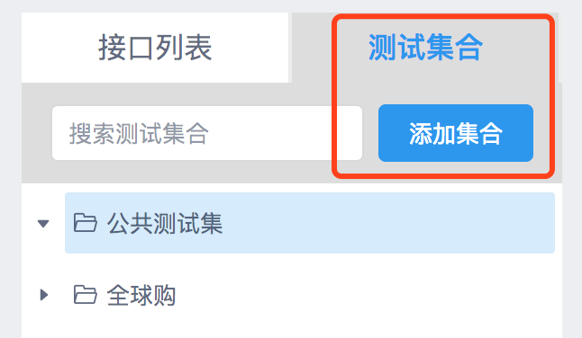  

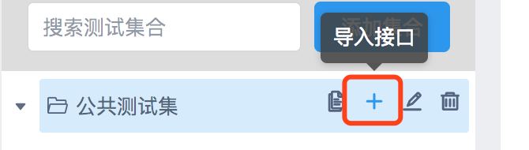  

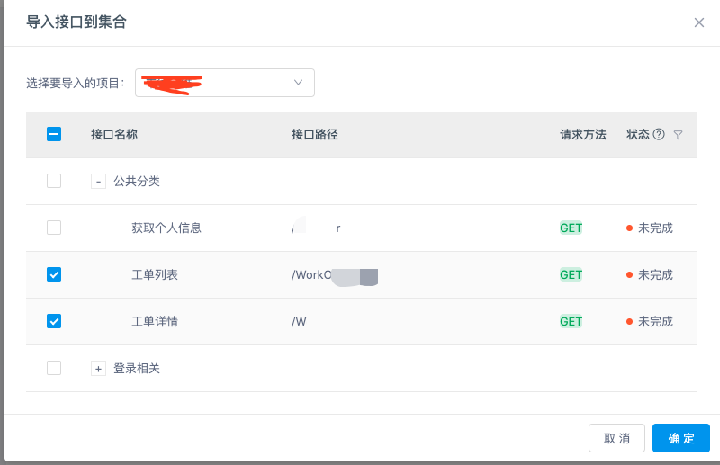  


## 第二步，编辑测试用例

编写测试用例主要涉及两个方面，一个是请求参数，另外一个是断言脚本。

### 编辑请求参数

请求参数可以填写期望的字符串，YApi 还提供了 Mock 参数和 变量参数。Mock参数用来生成随机字符串，变量参数是为了解决请求参数依赖其他接口的返回数据或参数。

#### Mock 参数

Mock 参数每次请求都会生成随机字符串

  

#### 变量参数

YApi 提供了强大的变量参数功能，你可以在测试的时候使用前面接口的 `参数` 或 `返回值 `作为 后面接口的参数，即使接口之间存在依赖，也可以轻松 一键测试~

!> Tips: 参数只能是测试过程中排在前面的接口中的变量参数

格式：

```
$.{key}.{params|body}.{path}
```

例如：现有两个接口，分别是“导航标题”和“文章列表”


文章列表接口需要传参数: `当前标题(id)`，而这个`id` 需要通过` 导航标题 `的返回值获取，这时应在 `文章列表` 的参数输入框中根据前者的 `key` 找到对应 `id`。

`导航标题` 的参数和返回值有如下结构：

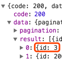  

则 `文章列表` 的参数可以如下配置：

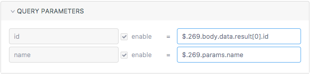  

其中 `$.` 是使用 动态变量 的标志，`$.269.params` 即表示 `key` 值为 269 用例的请求参数，`$.269.body` 即表示 `key` 值为 269 用例的返回值。

如果 requestBody 是 json 格式也可以在 json 中写变量参数，如下图：

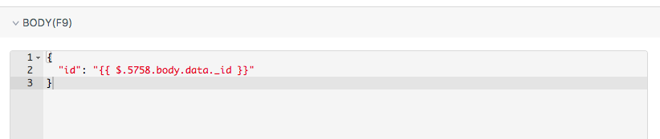  

!> Tips: 上下拖动测试集合的列表项可以调整测试的顺序。

目前 yapi 中的`query`，`body`,`header`和`pathParam`的输入参数已经支持点击选择功能。无需自己填写表达式，只需在弹窗中选择需要展示的表达式即可。 输入选项包括`常量`，`mock数据`，在测试集合中也支持变量选择。具体用法：单击编辑按钮打开表达式生成器，点击需要的数据创建表达式，这里也可以实时查看表达式结果。

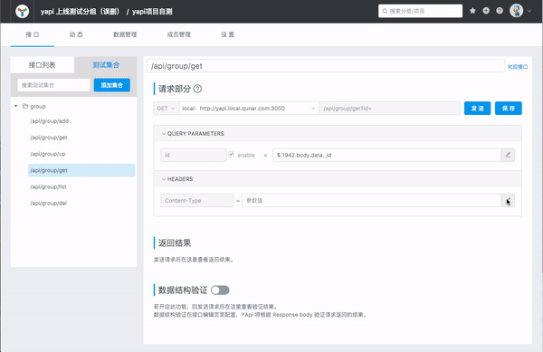  

!> Tips: 在测试集合中插入变量参数可以会出现下图的提示信息，这是正常现象。因为该参数只能在各个接口顺序执行的时候才能拉到变量参数中的值

  

### 编写断言脚本

编写完请求参数，可通过 js 脚本写断言，实现精准测试，在接口用例页面点击 Test 编辑。

  

## 第三步，运行自动化测试

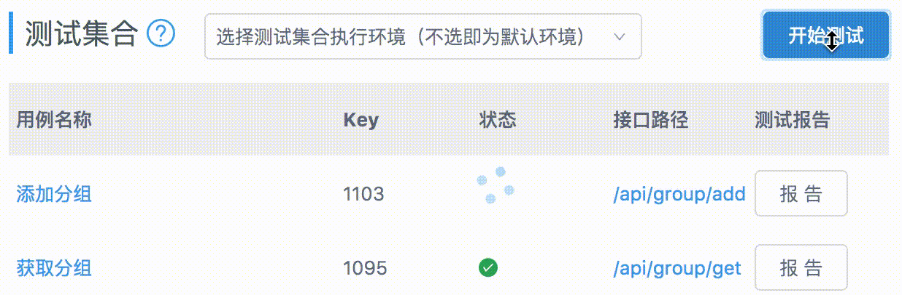  

在测试列表可以看到每个测试用例的 key,还有 开始测试、报告等功能

点击开始测试会按照 case 定义的参数从上往下一个一个进行测试，如果顺序有问题，可以拖动调整

测试完成之后，点击报告查看该次请求的结果


## 断言脚本公共变量

### 1.assert
这里的断言函数，主要基于nodejs的函数，详细 api 可查看 [document](https://nodejs.org/dist/latest-v8.x/docs/api/assert.html)

#### 常用 api

* assert(value)

判断 value 是否为 truth, 例如 assert(1) 通过， assert(0) 不通过，只要 value 不是 null, 0, false 等值验证通过

* assert.equal(actual, expected)

判断 actual 是否等于 expected，例如 assert(1, 1)通过

* assert.notEqual(actual, expected)

判断 actual 是否不等于 expected

* assert.deepEqual(actual, expected)

假设： actual = {a:1} 是一个对象，即便 expected = {a:1}，如果使用 assert.equal 可能也是不相等的，因为在 js 引用的只是对象的一个指针，需要使用 assert.deepEqual 比较两个对象是否相等

* assert.notDeepEaual(actual, expected)

深度比较两个对象是否不相等


### 2.status
http 状态码

### 3.params
http request params, 合并了 query 和 body

### 4.body
返回 response body

### 5.header
返回 response header

### 6.records
记录的 http 请求信息，假设需要获取 key 为 555 的接口参数或者响应数据，可通过 records[555].params 或 records[555].body 获取

### 7.log
log（message） 函数,调试时使用，log 信息仅仅在断言失败后打印,失败断言前的信息

```
log(234)   
assert.equal(status, 400)
log(123)
```
输出结果： log: 234
AssertionError: 200 == 400

#### 示例

```js
assert.equal(body.errcode, 0)
assert.equal(body.data.group_name, 'testGroup')
assert.equal(status, 200)
```

## 服务端自动化测试

开始测试功能是在浏览器跑自动化测试，他依赖于浏览器的使用环境。服务端自动化测试功能是在YApi服务端跑自动化测试，不需要依赖浏览器环境，只需要访问 YApi 提供的 url 链接就能跑自动化测试，非常的简单易用，而且可以集成到 jenkins。

### 详细使用方法

点击服务端测试，出现如下弹窗，用户访问该 url 就可以获取当前测试用例的所有测试结果。

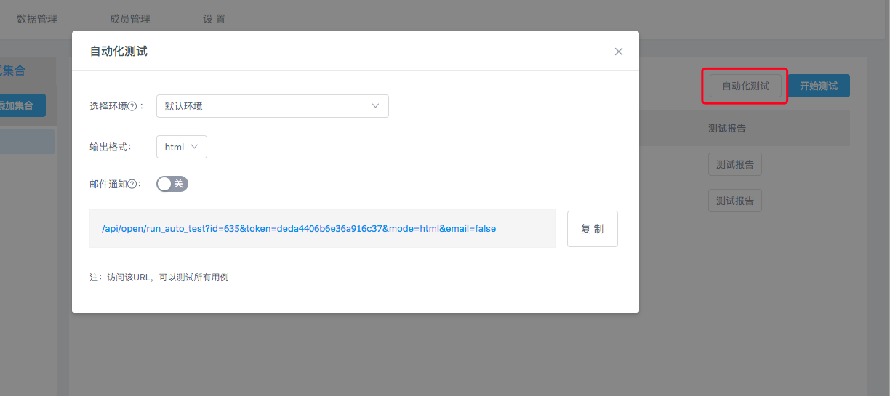  

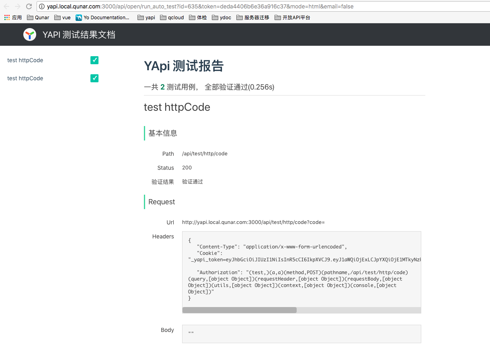  

## 配置通用规则

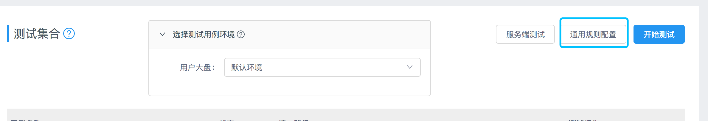  

配置通用规则能够使自动化测试，可以基于通用的规则去控制，无需手动一个一个维护case.