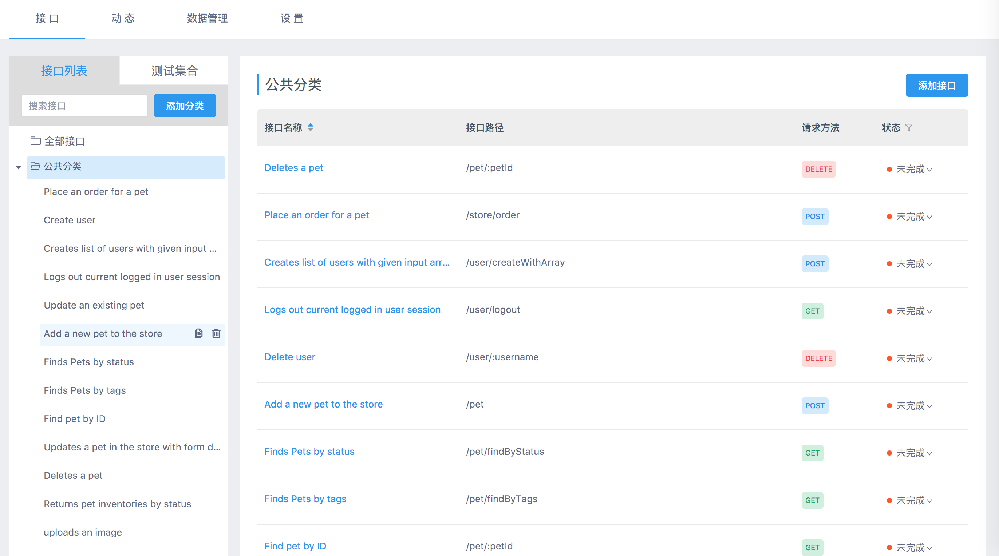

# 数据导入
> 创建时间：2020-08-10               
> 更新时间：{docsify-updated}

## Postman 数据导入

1. 首先在 postman 导出接口

  

2. 选择 collection_v1,点击 export 导出接口到文件 xxx

  

3. 打开 yapi 平台，进入到项目页面，点击数据管理，选择相应的分组和 postman 导入  方式， 选择刚才保存的文件路径，开始导入数据

  


## HAR数据导入

可用 chrome 实现录制接口数据的功能，方便开发者快速导入项目接口

1. 打开 Chrome 浏览器开发者工具，点击 network，首次使用请先 clear 所有请求信息，确保录制功能开启（红色为开启状态）

  

2. 操作页面实际功能，完成后点击 save as HAR with content,将数据保存到文件 xxx
!> Tips: save as HAR with content这个选项导出的是所有录制的接口，不是单个接口。
  

3. 打开 yapi 平台，进入到项目页面，点击数据管理，选择相应的分组和 har 导入  方式， 选择刚才保存的文件路径，开始导入数据

  

但是这样导入接口也没有那么完美，接口名字是接口路径，以及可能接口入参可能会有被转码的情况。如下图

  
  

!> Tips: har 数据导入只支持 response.content.mimeType 为 application/json 类型的数据

## Swagger 数据导入

[什么是 Swagger ？](docs/knowledge.md?id=什么是swagger)

1.生成 JSON 语言编写的 Swagger API 文档文件

例如这样的数据 （http://petstore.swagger.io/v2/swagger.json），可以将其内容复制到 JSON 文件中。

> Tips: yapi支持 swagger url 导入功能

2.打开 yapi 平台，进入到项目页面，点击数据管理，选择相应的分组和 swagger 导入  方式， 选择刚才的文件，开始导入数据

  
  
  


## JSON 数据导入

可以导入在 yapi 平台导出的 json 接口数据。

  

## 通过命令行导入接口数据
YApi 支持通过命令行导入接口数据，他的应用场景是做自动化集成，比如配合 swagger ，接口文档前端不用维护，交由后端生成。

#### 使用方法

第一步，确保 yapi-cli >= 1.2.7 版本，如果低于此版本请升级 yapi-cli 工具

```shell
npm install -g yapi-cli
```

第二步，在任意一个目录下新建配置文件 yapi-import.json，内容如下：

```json
{
  "type": "swagger",
  "token": "17fba0027f300248b804",
  "file": "swagger.json",
  "merge": "normal",
  "server": "http://yapi.local.qunar.com:3000"
}
```
`type` 是数据数据方式，目前官方只支持 swagger

`token` 是项目 token，在 项目设置 -> token 设置获取

`file` 是 swagger 接口文档文件，可使用绝对路径或 url

`merge` 有三种导入方式(v1.3.23+支持) normal, good, mergin

1. 普通模式(normal)：不导入已存在的接口；
2. 智能合并(good)：已存在的接口，将合并返回数据的 response，适用于导入了 swagger 数据，保留对数据结构的改动；
3. 完全覆盖(mergin)：不保留旧数据，完全使用新数据，适用于接口定义完全交给后端定义， 默认为 normal

`server` 是 yapi 服务器地址

第三步，在新建配置文件的当前目录，执行下面指令

```
yapi import
```