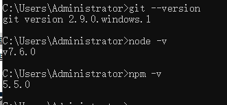
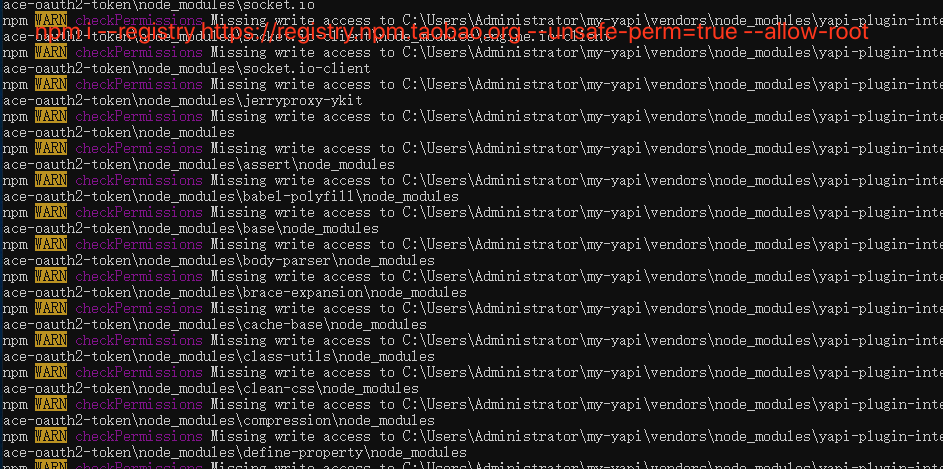
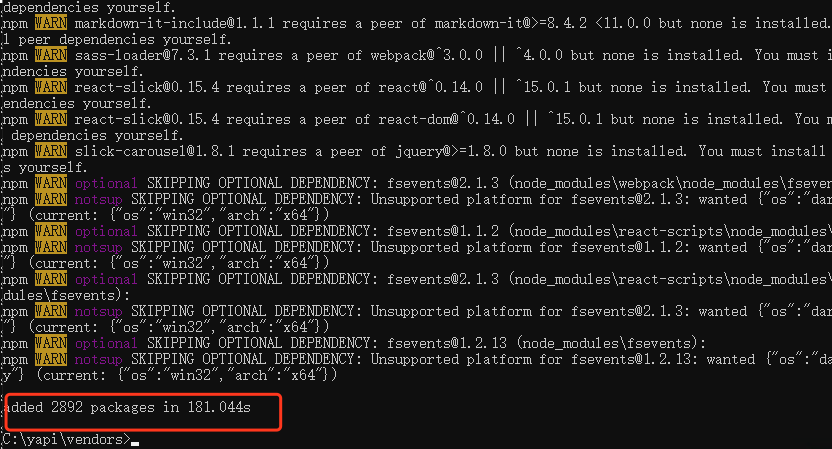
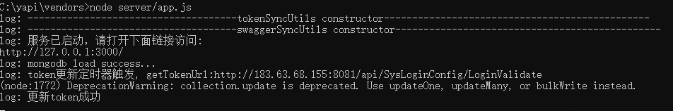
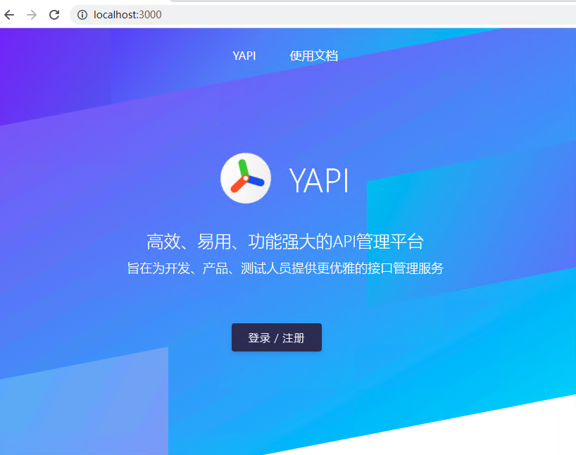
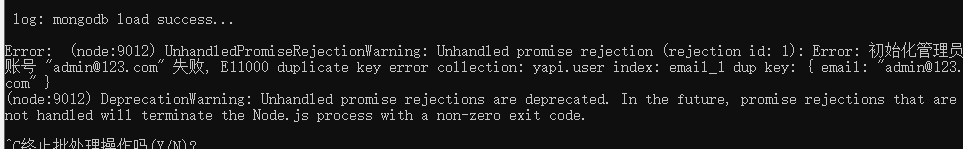
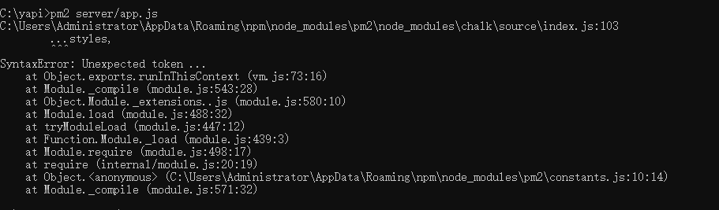

# 内网部署
> 创建时间：2020-08-01                
> 更新时间：{docsify-updated}

可使用官方提供的 yapi-cli 工具，部署 YApi 平台是非常容易的。官方建议部署成 http 站点，因 chrome 浏览器安全限制，部署成 https 会导致测试功能在请求 http 站点时文件上传功能异常。


### 环境要求

* nodejs（一点要保证node为v7.6,npm大于5.0，不然后续安装插件会有各种问题)
* mongodb（2.6+）
* git
* node-sass
* yapi-cli
* ykit
* pm2（服务管理）
* 网络保证畅通

## 安装mongodb

### macOS环境
> nodejs(v10.17.0)、 npm(v6.14.5)

1. mac直接终端操作比较好用

```shell
# 进入 /usr/local
cd /usr/local

# 下载
sudo curl -O https://fastdl.mongodb.org/osx/mongodb-osx-ssl-x86_64-4.0.9.tgz

# 解压
sudo tar -zxvf mongodb-osx-ssl-x86_64-4.0.9.tgz

# 重命名为 mongodb 目录

sudo mv mongodb-osx-x86_64-4.0.9/ mongodb
```


2. 安装完成后，我们可以把 MongoDB 的二进制命令文件目录（安装目录/bin）添加到 PATH 路径中：


```shell
# 打开环境变量的文件
open ~/.bash_profile

# 复制下面两行命令，放进.bash_profile文件，注意路径
export MONGO_PATH=/usr/local/mongodb
export PATH=$PATH:$MONGO_PATH/bin
# 复制完成后，关闭.bash_profile文件

# 再执行命令，这个命令会使环境变量生效
source .bash_profile 
```

3. 打开finder，快捷键【shift+cmd+G】前往文件夹，输入路径`/usr/local/mongodb`,这个路径就是刚刚下载的MongoDB的源码路径

  

4、在mongodb根目录下新建 data 文件夹，里面再建一个 db 文件夹，安装MongoDB时并不会自动生成，需要我们手动创建，可以在命令行输入创建，也可以直接在Finder中手动新建然后在MongoDB目录下新建 data 文件夹，里面再建一个db文件夹，里面是用来存放数据库的。新建一个etc文件夹，用来放文件配置，新建配置文件mongod.conf。data/db——和于存放数据文件，etc——用于存放mongod.conf，log——用于存放mongod.log 错误日志。

  

mongod.conf 内容如下
```shell
#mongodb config file
dbpath=/usr/local/mongodb/data/db
logpath=/usr/local/mongodb/log/ 
logappend = true 
port = 27017 
fork = true 
auth = true
```

4. 终端输入命令：`mongod -version`，有以下效果就证明已经安装成功了

 

5. 出现上面的只能证明你本地安装MongoDB了，但是MongoDB可能还没有跑起来。需要你输入一下命令
```shell
 sudo mongod --dbpath=/usr/local/mongodb/data/db
```
  

6. 浏览器输入地址：`http://localhost:27017/`。这个是证明数据库以及跑起来了
  


### MongoDB的一些常用操作
```shell
## mongodb在window10的项目路径为：C:\Program Files\MongoDB\Server\4.2\bin
## 要用MongoDB的命令操作，先进入项目路径
$ cd C:\Program Files\MongoDB\Server\4.2\bin

## 然后输入mongo，进入数据命令操作行
$ mongo

## 查询本地所有数据库名称
$ show dbs

## 切换至指定数据库环境（若无指定的数据库，则创建新的库）
$ use yapi

## 删除指定数据库
$ db.dropDatabase()
```


## 安装yapi-cli

```shell
npm install -g yapi-cli --registry https://registry.npm.taobao.org

yapi server
# 跑完命令会提示：在浏览器打开 http://0.0.0.0:9090 访问。非本地服务器，请将 0.0.0.0 替换成指定的域名或ip 
```

执行 yapi server 启动可视化部署程序，输入相应的配置和点击开始部署，就能完成整个网站的部署。部署完成之后，可按照提示信息，执行 node/{网站路径/server/app.js} 启动服务器。在浏览器打开指定url, 点击登录输入您刚才设置的管理员邮箱，默认密码(ymfe.org) 登录系统（默认密码可在个人中心修改）。

  


## 实际场景的部署方案
> 前面提到的各种环境的安装其实都是按部就班地安装部署API管理网站，实际上，官方曾提到过不支持window二次开发，在实际操作中也验证过，如果在window上部署，有安装node依赖以及安装token插件的各种错误，导致部署失败，实践证明，目前的解决办法是通过在macOS系统或者Linux系统先部署成功后，把项目文件复制到window上，再重新npm i安装node需要所有依赖包即可以完成部署

1. 保证MongoDB已经安装成功后，从SVN下载项目包yapi。里面文件夹`tools`有node安装文件和Git安装文件。yapi项目包放那个目录底下都没问题，优先考虑放c盘，案例的路径为：`C:\yapi`,先安装`tools`里面的node和git（先用命令检查一下本地是否自带Git环境）。安装完之后，在`cmd`终端里查询两者的是否安装成功。
      

2. 继续安装`yapi-cli`脚手架、服务管理器`pm2`、`node-sass`、`ykit`打包工具
   
```shell
##npm用淘宝命令，安装速度更快 --registry https://registry.npm.taobao.org

##安装脚手架yapi-cli
npm install -g yapi-cli --registry https://registry.npm.taobao.org

##安装服务管理器
npm install -g pm2 --registry https://registry.npm.taobao.org

##安装node-sass
npm install -g node-sass --registry https://registry.npm.taobao.org

## 安装打包工具 ykit，必须版本是v0.8.x
npm install -g ykit --registry https://registry.npm.taobao.org
```

3. 环境一切准备就绪，进入项目，安装一些项目依赖文件

```shell
##进入项目
cd C:\yapi/vendors

##输入命令安装依赖
npm install --registry https://registry.npm.taobao.org
##这一步安装依赖有可能安装失败，如果报错信息出现‘checkPermissions’这些关键字，需要用以下命令，再安装一次，覆盖失败的安装
npm i --registry https://registry.npm.taobao.org --unsafe-perm=true --allow-root
```
  

安装依赖成功的截图

  

4. 输入命令运行项目文件

```shell
node vendors/app.js
```

项目运行成功的截图，这里有token更新，是因为小编本地刚刚配置token，数据库就存有这个配置了，如果第一次部署，数据库没东西的话，是没有token

  
  

## 服务器管理
> yapi接口管理网站是前端工程react为技术核心搭建，主要服务器方面主要依靠nodejs搭建，用命令`node vendors/app.js`跑起来的项目，如果不用有效的服务管理器管理，可能会因为不小心关闭cmd窗口或者关机而中断服务。

推荐使用 pm2 管理 node 服务器启动，停止，具体使用方法可参考下面的教程：

* [官网文档](https://pm2.keymetrics.io/docs/usage/quick-start/)
* [PM2实用入门指南](https://imweb.io/topic/57c8cbb27f226f687b365636)

我们常用到的pm2命令大全

```shell
##检查pm2是否安装成功

##利用pm2管理yapi接口项目： pm2 start [项目的app.js具体地址]
$ cd C:\yapi/
$ pm2 start vendors/server/app.js --name yapi  --watch
##--name[指定监听的这个进程的名字] 
##--watch[监听应用目录的变化，一旦发生变化，自动重启。如果要精确监听、不见听的目录，最好通过配置文件。]

## 查看进程状态
$ pm2 list

##停止特定的应用。pm2 stop [app_name || app_id]
$ pm2 stop yapi

##重启yapi网站
$ pm2 restart vendors/server/app.js
```
已经启动服务管理器管理的成功截图如下：


## 遇到的问题
1. 部署yapi的网站的时候，初始化管理员账号的时候，报错，原因因为MongoDB已经存在了yapi的数据库，需要删除yapi的数据库才能初始化成功

  

1. 使用pm2管理服务，有报错，这是因为node-v7.6,node版本太低，pm2全局安装的时候没有指定低版本的，pm2的版本太高，导致pm2运行不了，卸载v7.6，重新安装svn里面的8.10.0即可

  
