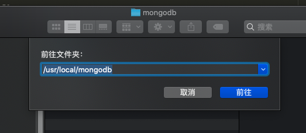
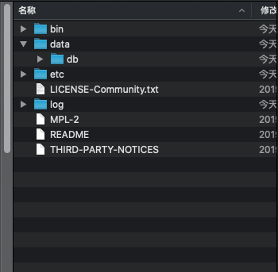
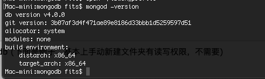
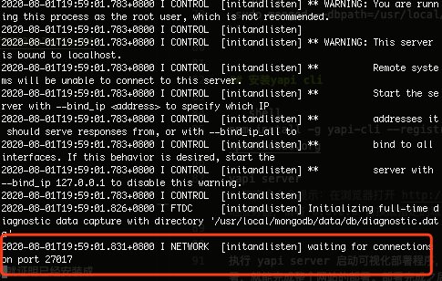
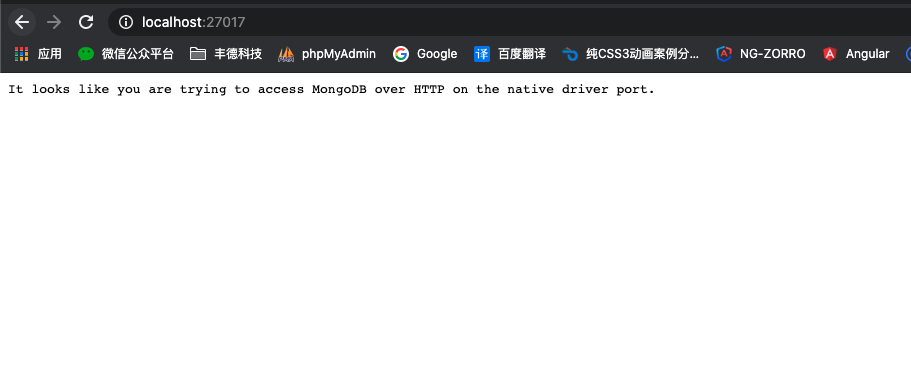
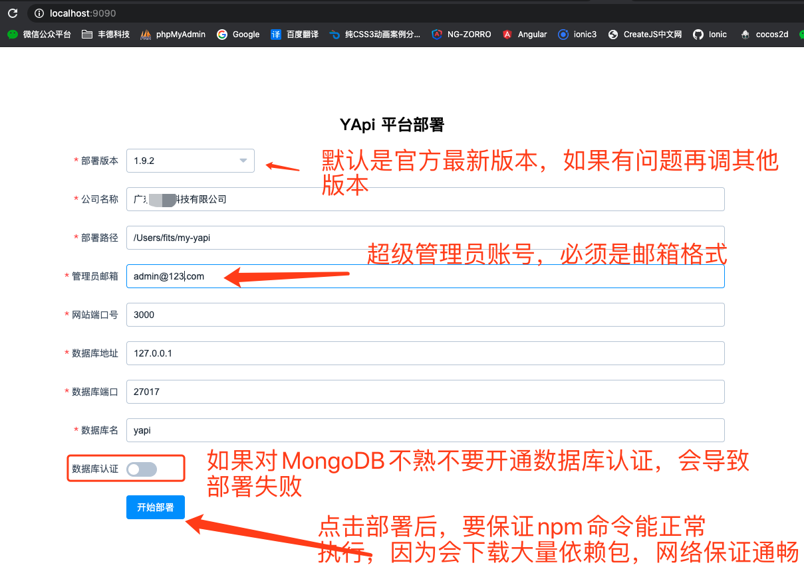

# 内网部署
> 创建时间：2020-08-01                
> 更新时间：{docsify-updated}

可使用官方提供的 yapi-cli 工具，部署 YApi 平台是非常容易的。官方建议部署成 http 站点，因 chrome 浏览器安全限制，部署成 https 会导致测试功能在请求 http 站点时文件上传功能异常。


### 环境要求

* nodejs（7.6+)
* mongodb（2.6+）
* 网络保证畅通

## 安装mongodb

### macOS环境
> nodejs(v10.17.0)、 npm(v6.14.5)

1. mac直接终端操作比较好用

```shell
# 进入 /usr/local
cd /usr/local

# 下载
sudo curl -O https://fastdl.mongodb.org/osx/mongodb-osx-ssl-x86_64-4.0.9.tgz

# 解压
sudo tar -zxvf mongodb-osx-ssl-x86_64-4.0.9.tgz

# 重命名为 mongodb 目录

sudo mv mongodb-osx-x86_64-4.0.9/ mongodb
```


2. 安装完成后，我们可以把 MongoDB 的二进制命令文件目录（安装目录/bin）添加到 PATH 路径中：


```shell
# 打开环境变量的文件
open ~/.bash_profile

# 复制下面两行命令，放进.bash_profile文件，注意路径
export MONGO_PATH=/usr/local/mongodb
export PATH=$PATH:$MONGO_PATH/bin
# 复制完成后，关闭.bash_profile文件

# 再执行命令，这个命令会使环境变量生效
source .bash_profile 
```

3. 打开finder，快捷键【shift+cmd+G】前往文件夹，输入路径`/usr/local/mongodb`,这个路径就是刚刚下载的MongoDB的源码路径

  

4、在mongodb根目录下新建 data 文件夹，里面再建一个 db 文件夹，安装MongoDB时并不会自动生成，需要我们手动创建，可以在命令行输入创建，也可以直接在Finder中手动新建然后在MongoDB目录下新建 data 文件夹，里面再建一个db文件夹，里面是用来存放数据库的。新建一个etc文件夹，用来放文件配置，新建配置文件mongod.conf。data/db——和于存放数据文件，etc——用于存放mongod.conf，log——用于存放mongod.log 错误日志。

  

mongod.conf 内容如下
```shell
#mongodb config file
dbpath=/usr/local/mongodb/data/db
logpath=/usr/local/mongodb/log/ 
logappend = true 
port = 27017 
fork = true 
auth = true
```

4. 终端输入命令：`mongod -version`，有以下效果就证明已经安装成功了

 

5. 出现上面的只能证明你本地安装MongoDB了，但是MongoDB可能还没有跑起来。需要你输入一下命令
```shell
 sudo mongod --dbpath=/usr/local/mongodb/data/db
```
  

6. 浏览器输入地址：`http://localhost:27017/`。这个是证明数据库以及跑起来了
  


## 安装yapi cli

```shell
npm install -g yapi-cli --registry https://registry.npm.taobao.org

yapi server
# 跑完命令会提示：在浏览器打开 http://0.0.0.0:9090 访问。非本地服务器，请将 0.0.0.0 替换成指定的域名或ip 
```

执行 yapi server 启动可视化部署程序，输入相应的配置和点击开始部署，就能完成整个网站的部署。部署完成之后，可按照提示信息，执行 node/{网站路径/server/app.js} 启动服务器。在浏览器打开指定url, 点击登录输入您刚才设置的管理员邮箱，默认密码(ymfe.org) 登录系统（默认密码可在个人中心修改）。

  
