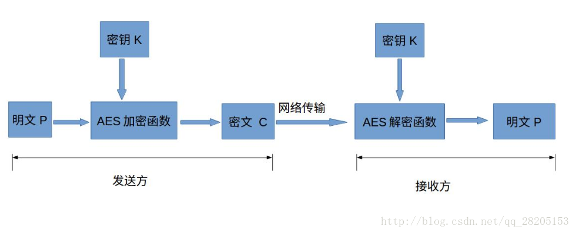
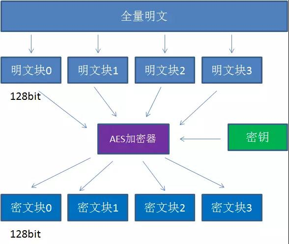

# 知识拓展
> 创建时间：2020-08-07               
> 更新时间：{docsify-updated}

## 什么是JSON5

`JSON5` 是对 `JSON` 的一种推荐扩展，旨在使人类更易于手动编写和维护。 它通过直接从 ECMAScript 5 添加一些最小的语法功能来实现这一点。

JSON5 仍然是 JavaScript 的严格子集，不添加任何新的数据类型，并且可以处理所有现有的 JSON 内容。

先通过一个例子看看 JSON5 的结构:

```json
{
	foo: '11.1.5，bar'],
	while: true,

    // 字符串可以是多行的，只要加上反斜杠
	this: 'is a \
multi-line string',

	// 字符串可以用单引号
	here: 'is another', 

    // 数字可以是十六进制（基数为16）／以小数点开头或结尾／包括Infinity，-Infinity，NaN和-NaN／以明确的加号开始。
	hex: 0xDEADbeef,
	half: .5,
	delta: +10,
	to: Infinity, 

	finally: 'a trailing comma',
	oh: [
		"we shouldn't forget",
		'arrays can have',
		'trailing commas too',
	],
    'gulp-jshint': "^2.0.0",
}
```

由此我们可以来讨论下它与 JSON 格式的区别

1. `key` 只要是有效的标识符，则可以不加引号。即使是 ES5 中的保留关键字
2. `key-value` 都可以使用单引号
3. 对象和数组尾巴都可跟着逗号
4. 字符串可以是多行的，只要加上反斜杠
5. 数字可以是十六进制（基数为16）／以小数点开头或结尾／包括Infinity，-Infinity，NaN和-NaN／以明确的加号开始
6. 允许使用注释，单行多行都可以

`JSON5` 更像 `Javascript` 对象了，就像开始说的，它更适合人们编写了。但是它并不是 `JSON` 官方的扩展，所以需要 `json5` 作为文件扩展名，下面的 `package.json5` 是现在普遍的写法。

```json
// This file is written in JSON5 syntax, naturally, but npm needs a regular
// JSON file, so compile via `npm run build`. Be sure to keep both in sync!

{
	name: 'json5',
	version: '0.5.0',
	description: 'JSON for the ES5 era.',
	keywords: ['json', 'es5'],
	author: 'Aseem Kishore <aseem.kishore@gmail.com>',
	contributors: [
		// TODO: Should we remove this section in favor of GitHub's list?
		// https://github.com/json5/json5/contributors
		'Max Nanasy <max.nanasy@gmail.com>',
		'Andrew Eisenberg <andrew@eisenberg.as>',
		'Jordan Tucker <jordanbtucker@gmail.com>',
	],
	main: 'lib/json5.js',
	bin: 'lib/cli.js',
	files: ["lib/"],
	dependencies: {},
	devDependencies: {
		gulp: "^3.9.1",
		'gulp-jshint': "^2.0.0",
		jshint: "^2.9.1",
		'jshint-stylish': "^2.1.0",
		mocha: "^2.4.5"
	},
	scripts: {
		build: 'node ./lib/cli.js -c package.json5',
		test: 'mocha --ui exports --reporter spec',
			// TODO: Would it be better to define these in a mocha.opts file?
	},
	homepage: 'http://json5.org/',
	license: 'MIT',
	repository: {
		type: 'git',
		url: 'https://github.com/json5/json5',
	},
}
```

### JSON5的使用

#### Node

```js
var JSON5 = require('json5');
```

#### html


```html
<script src="json5.js"></script>
```

转换


```js
var obj = JSON5.parse('{unquoted:"key",trailing:"comma",}');
var str = JSON5.stringify(obj);
```

## 什么是JSON Schema
> [原文地址](https://juejin.im/post/6844903848239169550)

要了解[JSON Schema](https://www.jianshu.com/p/8278eb2458c4?winzoom=1)是什么，我们应该首先了解JSON是什么。

JSON代表 `JavaScript Object Notation`，一种简单的互联网数据交换格式。由于JavaScript存在于绝大多数Web浏览器中，而JSON基于JavaScript而来，因此很容易在JavaScript中的得到支持。同时，它已被证明足够有用且足够简单，现在也被用于许多其他不涉及互联网数据交换的环境中。

从本质上讲，JSON建立在以下数据结构上：

```js
对象：
{ "key1": "value1", "key2": "value2" }
数组：
[ "first", "second", "third" ]
数值：
42 3.1415926
字符串：
"This is a string"
布尔：
true false
空值：
null
```

以上这些类型在大多数编程语言中都有接近的对照类型，但它们可能有不同的名称。

利用这些简单的数据类型，可以表示出各种结构化数据。然而，这种巨大的灵活性带来了巨大的责任，因为同样的概念可以用无数种方式表现出来。例如，你可以想象以不同方式表示有关JSON中某人的信息：

```json
{ 
  "name": "George Washington",
  "birthday": "February 22, 1732",
  "address": "Mount Vernon, Virginia, United States"
}
```

以上的json数据可以转化为语义更强的json格式

```json
{ 
  "first_name": "George",
  "last_name": "Washington",
  "birthday": "1732-02-22",
  "address": {
    "street_address": "3200 Mount Vernon Memorial Highway",
    "city": "Mount Vernon",
    "state": "Virginia",
    "country": "United States"
  }
}
```

以上这两种表述同样有效，但第二种显然比第一种更正式。数据记录的设计在很大程度上取决于其在应用程序中的预期用途，以上两种json格式没有错对之分。但是，当应用程序通过API请求并期望得到一个人的JSON记录时，重要的是要确切知道该记录应该如何组织。也就是说，当我们需要知道JSON数据中预期的字段以及值的表示方式时，这就是JSON Schema的用武之地。

以下JSON Schema片段描述了上面第二个例子是如何构建的。如果仔细观察，你可以看到，以上第二个例子中的JSON数据结构，以及其中各个字段的类型信息在这里得到了很清晰的说明。

```json
{
  "type": "object",
  "properties": {
    "first_name": {
      "type": "string"
    },
    "last_name": {
      "type": "string"
    },
    "birthday": {
      "type": "string",
      "format": "date"
    },
    "address": {
      "type": "object",
      "properties": {
        "street_address": {
          "type": "string"
        },
        "city": {
          "type": "string"
        },
        "state": {
          "type": "string"
        },
        "country": {
          "type": "string"
        }
      }
    }
  }
}
```

您可能已经注意到，JSON Schema本身是用JSON编写的。它是JSON数据的规范，而不是计算机程序。它只是“描述JSON数据结构”的声明格式。这既是它的优势，也是它的弱点（和其他Schema语言类似）。它很容易简洁地描述数据的表面结构，并可被用于在程序运行时自动验证数据。但是，由于JSON Schema不能包含任意代码，因此对无法表达的数据元素之间的关系存在某些限制。因此，对于足够复杂的数据格式的任何“验证工具”可能具有两个验证阶段：一个在结构级别，另一个在语义级别。对于结构级别的检查，可以使用Schema语言。对于语义级别的检查，可能需要使用更通用的编程语言来实现。

JSON Schema在API的设计与实现中具有相当重要的作用。具备JSON Schema校验能力的API实现可以帮助对来自用户输入数据的自动校验，以及应用在各类需要在程序运行时完成校验的场景中。这可以帮助开发者以更加规范、严谨的方式来描述自己的API上承载的JSON数据，同时少写许多手工校验的程序代码。

遗憾的是，目前流行的REST API设计并不能直接使用JSON Schema带来的这种能力，这很大程度上在于，在REST API的设计理念中，API请求的参数并不是一个JSON对象，而是以资源模型的方式来描述，这使得无法使用JSON Schema来描述和自动校验这类API上传递的数据。

总结归纳来说，`JSON Schema`更多是JSON数据的一个结构型规范标准，如果定义好的接口出参了，但是你传过来的json格式跟原先你在接口设计的时候定义好的类型不一样的时候，会检查出你的json格式不通过。举个例子，我们经常会遇到的一种情况，就是我们在设计接口的时候，明明定义好了出参`价格`是个number类型，但是实际开发过程中，你却把价格做成string类型返回回来，这样你在使用yapi这个接口管理网站的时候，会校验你的返回json有问题，帮助你纠正错误

## 什么是AES对称加密

!> 这块主要针对前端在使用CryptoJS这个AES对称加密的库时，能对常用的对称加密有清楚认识

### 什么是对称加密

对称加密是最快速、最简单的一种加密方式，加密（encryption）与解密（decryption）用的是同样的密钥（secret key）。工作过程也十分简单：发送方使用密钥将明文数据加密成密文，然后发送出去，接收方收到密文后，使用同一个密钥将密文解密成明文读取。优点明显： 加密计算量小、速度块，适合对大量数据进行加密的场景

### 什么是AES对称加密

高级加密标准(AES,Advanced Encryption Standard)为最常见的对称加密算法(微信小程序加密传输就是用这个加密算法的)。对称加密算法也就是加密和解密用相同的密钥。它具有以下特点：

 1. 最常用的对称加密算法
 2. 密钥建立时间短、灵敏性好、内存需求低
 3. 工作模式可以引入IV（偏移量），偏移量必须为16位的字节数组
 4. 密钥长度128/192/256，其中192与256需要配置无政策限制权限文件（JDK6）
 5. 填充模式最常用的两种PKCS5Padding和PKCS7Padding
 6. 加密和解密用到的密钥是相同的，这种加密方式加密速度非常快，适合经常发送数据的场景

具体的加密流程如下：


  


#### AES对称加密跟md5、sha1 、sha256、sha512这样的哈希摘要算法有什么不同？

!> 注意：要摘要算法不是加密算法，不能用于加密（因为无法通过摘要反推明文），只能用于防篡改，但是它的单向计算特性决定了可以在不存储明文口令的情况下验证用户口令。

md5这种摘要算法是不可逆的，它的主要作用是对信息一致性和完整性的校验。而对称加密算法是可逆的，它的主要作用是保证私密信息不被泄露。

#### AES对称加密三个最重要基本概念：密钥、填充、模式

1. 密钥

密钥是AES算法实现加密和解密的根本。对称加密算法之所以对称，是因为这类算法对明文的加密和解密需要使用同一个密钥。

AES支持三种长度的密钥：128位，192位，256位

从安全性来看，AES256安全性最高。从性能来看，AES128性能最高。本质原因是它们的加密处理轮数不同

2. 填充

要想了解填充的概念，我们先要了解AES的分组加密特性。

什么是分组加密呢？我们来看看下面这张图：

  

AES算法在对明文加密的时候，并不是把整个明文一股脑加密成一整段密文，而是把明文拆分成一个个独立的明文块，每一个明文块长度128bit。

这些明文块经过AES加密器的复杂处理，生成一个个独立的密文块，这些密文块拼接在一起，就是最终的AES加密结果。

但是这里涉及到一个问题：

假如一段明文长度是192bit，如果按每128bit一个明文块来拆分的话，第二个明文块只有64bit，不足128bit。这时候怎么办呢？就需要对明文块进行填充（Padding）。填充方式有以下几种：

* NoPadding：不做任何填充，但是要求明文必须是16字节的整数倍。
* PKCS5Padding（默认）：如果明文块少于16个字节（128bit），在明文块末尾补足相应数量的字符，且每个字节的值等于缺少的字符数。比如明文：{1,2,3,4,5,a,b,c,d,e},缺少6个字节，则补全为{1,2,3,4,5,a,b,c,d,e,6,6,6,6,6,6}
* ISO10126Padding：如果明文块少于16个字节（128bit），在明文块末尾补足相应数量的字节，最后一个字符值等于缺少的字符数，其他字符填充随机数。比如明文：{1,2,3,4,5,a,b,c,d,e},缺少6个字节，则可能补全为{1,2,3,4,5,a,b,c,d,e,5,c,3,G,$,6}
* PKCS7Padding，同PKCS5Padding差不多的意思，就是假设数据长度需要填充n(n>0)个字节才对齐，那么填充n个字节，每个字节都是n;如果数据本身就已经对齐了，则填充一块长度为块大小的数据，每个字节都是块大小

3. [模式](https://www.jianshu.com/p/463e8df0a045)

AES的工作模式，体现在把明文块加密成密文块的处理过程中。AES加密算法提供了五种不同的工作模式：

ECB、CBC、CTR、CFB、OFB

模式之间的主题思想是近似的，在处理细节上有一些差别，具体的你可以点击[这里](https://www.jianshu.com/p/463e8df0a045)获取更详细的介绍

!> 需要注意的是，如果在AES加密的时候使用了某一种填充方式、模式、密钥(key)、偏移量（iv），解密的时候也必须采用同样的方式。

### 如何使用[CryptoJS](https://github.com/brix/crypto-js)
> CryptoJS是一个加密库，它不单只是能使用AES对称加密，它还可以用于类似sha1的哈希摘要算法的加密，基本是前端最全的一个加密插件库。
#### 使用es6的语法

```js
// 首先要进入项目使用命令npm i CryptoJS
import * as CryptoJS from 'crypto-js';


/**
* 加密
* @param {*} word
*/
encrypt(word) {
	let srcs = CryptoJS.enc.Utf8.parse(word);
	let encrypted = CryptoJS.AES.encrypt(srcs, this.key, { iv: this.iv, mode: CryptoJS.mode.CBC, padding: CryptoJS.pad.Pkcs7 });
	console.log(encrypted.toString());// 这个加密后，不转base64的编码
	console.log(encrypted.ciphertext.toString()); // 这个主要转base64编码
	return encrypted.toString();
	// return encrypted.toString().toUpperCase();
}

/**
* 解密
* @param {*} word
*/
decrypts(word) {
	let decrypt = CryptoJS.AES.decrypt(word, this.key, { iv: this.iv, mode: CryptoJS.mode.CBC, padding: CryptoJS.pad.Pkcs7 });
	let decryptedStr = decrypt.toString(CryptoJS.enc.Utf8);
	return decryptedStr;
	// return decryptedStr.toString();
}

/**
* 解密
* 这里的解密是解密那些经过aes加密之后再被base64转码的
* @param {*} word
* @returns
* @memberof DataEncryptDecryptPage
*/
decryptBase64(word) {
	let encryptedHexStr = CryptoJS.enc.Hex.parse(word);
	let srcs = CryptoJS.enc.Base64.stringify(encryptedHexStr);
	let decrypt = CryptoJS.AES.decrypt(srcs, this.key, { iv: this.iv, mode: CryptoJS.mode.CBC, padding: CryptoJS.pad.Pkcs7 });
	let decryptedStr = decrypt.toString(CryptoJS.enc.Utf8);
	return decryptedStr.toString();
}
```

#### 关于AES的实践验证

* 改变IV的长度，发现当IV大于16字节的时候，不管16字节之后的是什么，都不影响加密结果，应该是种自动截取机制(nodejs原生库IV不是16字节，就会报错）
* 改变IV的长度，当IV小于16字节，还可以成功加密，可能是自动补齐机制
* 加密IV和解密IV不同的时候，并不影响解密是否成功，但是解密的结果有差别
* 修改padding，加密解密的padding换成NoPadding，发现解密之后生成utf8字符串出错
* 经过多次尝试，加密为Pkcs7和ZeroPadding时，加密后的字符串变化显著，这时解密用任何padding模式，都可以成功解密。

##### 关于AES的资料参考

1. [前端 crypto-js aes 加解密](https://www.jianshu.com/p/a47477e8126a)
2. [理解AES加密解密的使用方法](https://blog.csdn.net/vieri_32/article/details/48345023)
3. [AES加密算法的详细介绍与实现](https://blog.csdn.net/qq_28205153/article/details/55798628)
4. [对RSA和AES的理解](https://blog.csdn.net/huanhuanq1209/article/details/80614271)
5. [加密–RSA前端与后台的加密&解密](https://www.cnblogs.com/Leo_wl/p/5763243.html)


## 什么是Swagger

### 程序员的痛点

> 相信无论是前端还是后端开发，都或多或少地被接口文档折磨过。前端经常抱怨后端给的接口文档与实际情况不一致。后端又觉得编写及维护接口文档会耗费不少精力，经常来不及更新。其实无论是前端调用后端，还是后端调用后端，都期望有一个好的接口文档。但是这个接口文档对于程序员来说，就跟注释一样，经常会抱怨别人写的代码没有写注释，然而自己写起代码起来，最讨厌的，也是写注释。所以仅仅只通过强制来规范大家是不够的，随着时间推移，版本迭代，接口文档往往很容易就跟不上代码了。


Swagger 是一个规范且完整的框架，用于生成、描述、调用和可视化 RESTful 风格的 Web 服务。

Swagger 的目标是对 REST API 定义一个标准且和语言无关的接口，可以让人和计算机拥有无须访问源码、文档或网络流量监测就可以发现和理解服务的能力。当通过 Swagger 进行正确定义，用户可以理解远程服务并使用最少实现逻辑与远程服务进行交互。与为底层编程所实现的接口类似，Swagger 消除了调用服务时可能会有的猜测。

有兴趣继续专研的小伙伴，可以认真看看这边文章：[Swagger从入门到精通](https://raw.githubusercontent.com/caoguanjie/yapi-docs/master/assets/swagger.pdf)