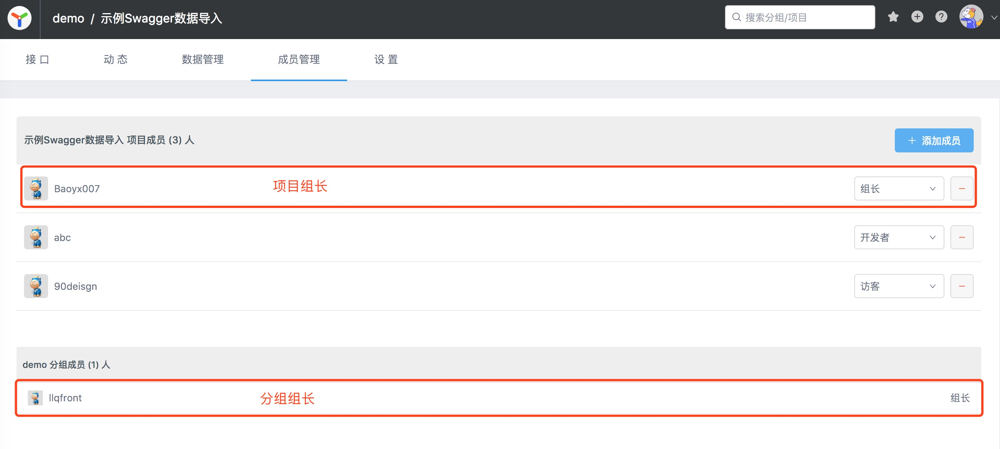
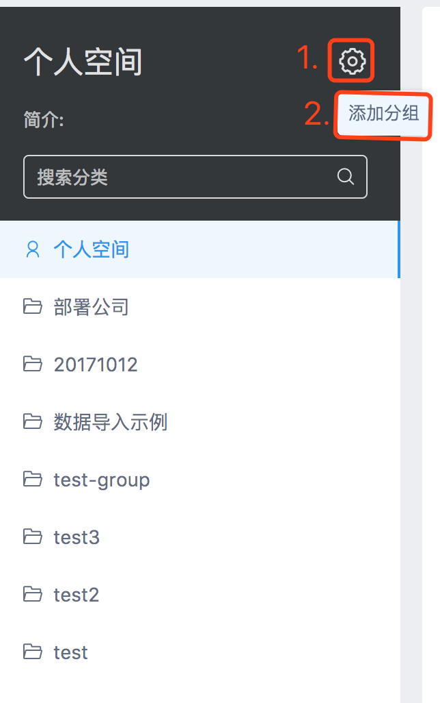

# 权限操作
> 创建时间：2020-08-06                
> 更新时间：{docsify-updated}

## 权限权利

接口管理的逻辑较为复杂，操作频率高，层层审批将严重拖慢生产效率，因此传统的金字塔管理模式并不适用。

YApi 将扁平化管理模式的思想引入到产品的权限管理中，超级管理员 拥有最高的权限，并将权限分配给若干 组长，超级管理员 只需管理组长 即可，实际上管理YAPI各大分组与项目的是“组长”。组长对分组或项目负责，一般由BU负责人/项目负责人担任。

## 认识组长

组长分为 `分组组长` 与 项目组长，他们的关系就是 一个分组内有若干 `分组组长` ，这些 `分组组长` 在创建项目时就可以指定`项目组长`。因此他们在职责上的区别就在于 `分组组长` 对分组负责 `项目组长` 对项目负责，二者其他具体区别如下：

  

`分组组长` 的权限包括修改分组、删除分组、创建分组下的项目。一般来说，`分组组长` 只需要对项目负责，将项目的操作任务安排给 `项目组长` 处理即可。

`项目组长` 只属于某一个项目因此它无法操作项目所属分组，但拥有项目的全部权限，`项目组长` 是 YApi 的基层管理者，承担了 YApi 绝大部分的日常管理工作。

## 创建分组

只有 `超级管理员` 有权限创建分组

  

成为 `分组成员`，即可在分组中创建项目。

  
> 想成为 `分组组长` ，在分组成员列表中找到 `分组组长`，联系 `分组组长` 将你设置为`分组组长`。

[怎样联系组长？](../docs/question.md)

## 权限列表

新用户未加入项目或分组时，我们称为 `“游客”`。

## 项目权限

| 操作               | 游客  | 项目开发者 | 项目组长 | 超级管理员 |
| ------------------ | :---: | :--------: | :------: | :--------: |
| 浏览公开项目与接口 |   ✓   |     ✓      |    ✓     |     ✓      |
| 浏览私有项目与接口 |       |     ✓      |    ✓     |     ✓      |
| 编辑项目信息       |       |     ✓      |    ✓     |     ✓      |
| 新建接口           |       |     ✓      |    ✓     |     ✓      |
| 编辑接口           |       |     ✓      |    ✓     |     ✓      |
| 编辑项目头像       |       |            |    ✓     |     ✓      |
| 删除项目           |       |            |    ✓     |     ✓      |

## 分组权限

| 操作             | 游客  | 项目开发者 | 项目组长 | 超级管理员 |
| ---------------- | :---: | :--------: | :------: | :--------: |
| 浏览分组         |   ✓   |     ✓      |    ✓     |     ✓      |
| 在分组中新建项目 |       |     ✓      |    ✓     |     ✓      |
| 编辑分组信息     |       |            |    ✓     |     ✓      |
| 管理分组成员     |       |            |    ✓     |     ✓      |
| 删除分组         |       |            |    ✓     |     ✓      |

