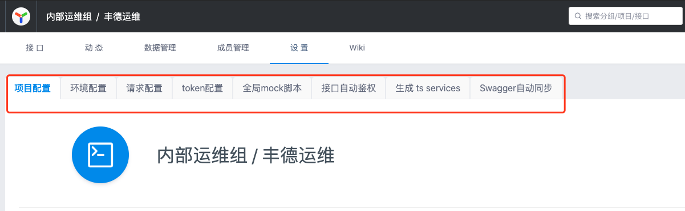

# 项目操作
> 创建时间：2020-08-06                
> 更新时间：{docsify-updated}

## 基本设置

1. tag 信息：可自定义tag名称和tag描述，tag信息可用在接口tag标识中;
2. mock 严格模式：开启后 mock 请求会对 query，body form 的必须字段和 json schema 进行校验; 不建议开启，我们公司不是很严格按照`RESTful API `的标准开发接口的，如果开启严格模式，会导致很多问题的产生
3. 开启json5：开启后允许接口请求body 和返回值中写 json 字段。yapi建议用户关闭 json5， 因为json-schema 格式可以进行接口格式校验。

  

## 新建项目

点击右上角的 `+` 新建项目，进入新建项目页面。

  

在新建项目页，填写项目信息：

> * 项目名称不允许重复，包括其他分组
> * 基本路径为接口统一添加了前缀
> * 新建项目页只列出了部分配置，其他详细配置(环境配置、项目图标等)需要进入项目页的“设置”面板进行配置。

  

## 修改项目

在项目页点击上方的 设置 `Tab` 进入项目设置面板，这个面板涵盖了项目的所有配置。

  

这里比新建项目页面新增的功能如下：

### 修改项目图标
点击项目图标，可以修改图标及背景色：

  

## 项目迁移

YApi 中支持项目迁移到不同的分组中。

  

迁移权限： 只有管理员和该项目的 `owner` 有权限对位置进行修改。项目 `owner` 主要有创建该项目的人、项目中的组长、创建分组的人、分组中的组长。

!> Tips: owner 权限判断的优先级是 项目权限 > 分组权限

## 项目拷贝

项目克隆功能可复制项目全部接口到一个新项目，如下图所示,点击红色框里面的 icon 使用。

YApi 支持项目复制功能，但是无法复制项目中的测试集合 list。

操作： 点击下图左上角的复制按钮，在弹窗中写入复制项目名称点击确定就可以完成项目复制

  
  

!> Tips: 如果你在该分组下有新建项目的权限，那你也同时拥有复制项目的权限

## 删除项目

点击下方的删除按钮，输入项目名称进行删除
> 删除项目是高风险操作，因此 YApi 对这个操作进行了特别的约束。

## 配置环境

`环境配置` 一项可以添加该项目下接口的实际环境，供 `接口测试` 使用，这里增加了全局 `header`，可以在项目中设置全局 `header` 值。在接口运行页面的选择环境 `select` 中也增加环境配置弹层。

  

用户可以在环境列表中定义全局变量的名称和值, 接口运行或者测试集合里面可以通过 {{ global.err }} 来访问当前环境变量下定义的全局变量

  


## 请求配置

pre-script, 通过自定义 js 脚本方式改变请求的参数和返回的 response 数据，简单来说，就是前端项目中经常用到HTTP拦截器，在请求发出去之前，对请求的内容进行修改，再发起HTTP请求。

### 请求参数示例
以 jquery ajax 为例，假设当前的请求参数是

```js
{
  url: '/api/user?id=1',
  method: 'POST',
  headers: {
    xxx: 'xxx'
  },
  data: {
    type: 1
  }
}
```

那么公共变量 `context` 包含以下属性：
> context是yapi项目里面开放的公共变量（全局变量），当前这个变量肯定是绑定当前项目的

```js
context = {
  href:"http://183.63.68.155:8081/api/SysUser",
  hostname: "183.63.68.155",
  pathname: '/api/user',
   caseId: 24, // context.caseId 测试用例的唯一 key 值
  query: {
    id: 1
  },
  requestHeader: {
    xxx: 'xxx'
  },
  method: 'POST',
  requestBody: {
    type:1
  }
}
```

假设我们需要在一组接口的 url 上增加一个公共的 token 参数，以内部运维组项目举例，每个URL的链接后面都需要加上token值，可以写如下自定义脚本：

```js
context.query.token = context.requestHeader.Authorization
```

官方还提供这样的例子大家参考下：
```js
context.query.token = context.utils.md5(context.pathname + 'salt');
```

因为token是拼接在URL上的参数，所以它是存在于query对象里面的。`context.requestHeader.Authorization`是拿header的参数`Authorization`赋值给token，因为自动token授权插件已经授权给Authorization参数了。


### 返回数据示例
在上面的示例请求完成后，在上面的示例请求完成后，假设返回responseData={a:1},公共变量 context 包含以下属性：

```js
context = {
  pathname: '/api/user',
  href:"http://183.63.68.155:8081/api/SysUser",
  hostname: "183.63.68.155",
  caseId: 24, // context.caseId 测试用例的唯一 key 值
  query: {
    id: 1
  },
  requestHeader: {
    xxx: 'xxx'
  },
  method: 'POST',
  requestBody: {
    type:1
  },
  responseData: { // 主要接受后台的返回参数
    a:1
  },
  responseHeader: {
    content-type: 'application/json'
    ...
  }
}
```

假设我们需要修改响应数据 responseData a 的值为 2，可以填写如下自定义脚本：

```js
context.responseData.a = 2;
```

### storage

storage.setItem 兼容浏览器和服务端，并且是持久化数据存储，不会丢失，用法类似于 localStorage。 storage 一共两个 api，分别是 setItem 和 getItem

```js
storage.setItem('xxx', 'token-----xxxxx')
context.query.token = storage.getItem('xxx')
```

### 工具函数
```js
context.utils = {
  _         //underscore 函数,详细 API 查看官网 http://underscorejs.org/
  CryptoJS  // crypto-js（v1.3.21+新增）, 详细用法看 https://github.com/brix/crypto-js
  base64    //转换字符串为 base64 编码
  md5       //转换字符串为 md5 编码
  sha1      //转换字符串为 sha1 编码
  sha224    //转换字符串为 sha224 编码
  sha256    //转换字符串为 sha256 编码
  sha384    //转换字符串为 sha384 编码
  sha512    //转换字符串为 sha512 编码
  unbase64  //转换 base64 编码为字符串  
  axios     // axios 库，可用于 api 请求，官网 https://github.com/axios/axios
}
```

#### CryptoJS 具体用法
> 详细用法，请查看【知识拓展】
```js
var data = [{ id: 1 }, { id: 2 }];

// Encrypt
var ciphertext = context.utils.CryptoJS.AES.encrypt(JSON.stringify(data), 'secret key 123');

// Decrypt
var bytes = context.utils.CryptoJS.AES.decrypt(ciphertext.toString(), 'secret key 123');
var decryptedData = JSON.parse(bytes.toString(CryptoJS.enc.Utf8));

console.log('decryptedData', decryptedData);
```

### 异步处理

处理请求参数，或返回数据，可能还会涉及到异步处理，比如 ajax 请求  
```js
context.promise = new Promise(function(resolve) {
  var api = context.utils.axios.get('http://yapi.local.qunar.com:3000/api/user/status');
  api.then(function(result) {
    //...
    console.log(result.data);
    resolve();
  });
});
```
promise 还可以来设置接口延迟
```js
context.promise = new Promise(function(resolve) {
  setTimeout(function() {
    console.log('delay 1000ms');
    resolve('ok');
  }, 1000);
});
```
使用方法就是在 context 里面添加 promise 参数,并且返回一个 Promise，不熟悉 Promise 的童鞋可以查下相关用法，ajax 请求可以使用 context.utils.axios 库。

!> 处理完成后，不要忘记 resolve()，不然会一直处于挂起状态


如果大家想看比较完整的`context`对象里面存在的参数，可以在 请求配置 中 Pre-request 和 Pre-response 输入js的控制台语句，并在任何一个接口发起请求，即可打印出来了。简单来说这两个多行文本框里面就可以写一些相关的js语句，里面可以调用一些项目的里面公共的变量和方法，在你请求任何一个接口的同时，会执行你写的方法

  


## token配置

每个项目都有唯一的标识 token，用户可以使用这个 token 值来请求 openapi。这里的token不是指我们某个项目中接口都需要的token，这个token是指你正在使用的接口文档关于你这个接口项目的token，可以用这个token来请求这个网站的一些开放接口，获取你想要的信息。

[openapi 文档地址](https://hellosean1025.github.io/yapi/openapi.html)

## 全局mock

全局 mock 设置，方便用户在项目层面上全局设置公共的mock数据，具体 mock 脚本详细使用方法详见 自定义 Mock 脚本

### Mock 优先级说明

请求 Mock 数据时，规则匹配优先级：Mock 期望 > 自定义 Mock 脚本 > 项目全局 mock 脚本 > 普通 Mock。

如果前面匹配到 Mock 数据，后面 Mock 则不返回。

## 接口自动鉴权
> 这个yapi的一个插件安装的服务，主要解决项目中每个接口都需要token参数，如果每次都点击【登录】接口获取token，然后请求任意接口时都需要复制最新的token，这样会大大增加我们的调试成本，所以安装这个自动化服务

  
  

获取路径该怎么填？？

以内部运维的登录接口举例，登录成功后的返回参数：

  

由上图很明显看出，yapi的返回参数是body里面的，市场上大部分ajax库返回参数其实也是body里面的。`LoginToken`是我需要的token，所以路径的写法就是`body.ReturnData.LoginToken`

!> 比较要注意的是，点击【保存】按钮之后，发现【获取token的地址】的输入框内保存的地址不是原来填写完整的URL地址，如果变成`192.168.32.230:8081/api/SysLoginConfig/LoginValidate`或者`/SysLoginConfig/LoginValidate`。这种情况token是更新失败，因为URL地址不对。如果发生这种情况，请联系管理员，应该是token插件安装失败，或者多尝试几次刷新浏览器，一定要保证是完整的URL地址。还有记得token点击保存后，记得刷新页面，这样其他接口才能正常使用token

  
  

## 生成ts services
暂未开发该功能，敬请期待

## Swagger自动同步
暂未开发该功能，敬请期待