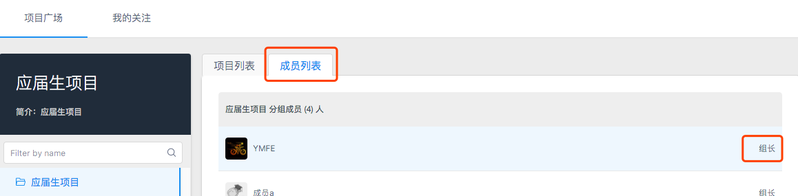
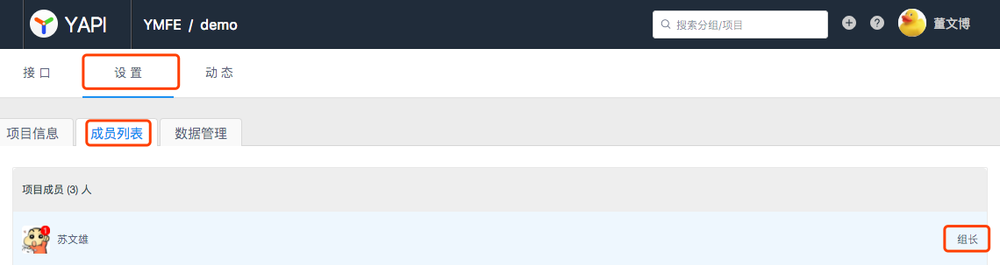

# 常见问题解答
> 创建时间：2020-08-06                
> 更新时间：{docsify-updated}

本页面罗列了大家使用 YApi 时遇到的常见问题.

如何没有找到你想要的答案，请联系反馈给组长，根据大家反馈的疑惑，会进行不定期的更新问题

## Q1.怎样联系组长？

组长分为 `分组组长` 和 `项目组长`:

* 分组组长：选择首页左侧的分组，点击右侧面板的 成员列表，成员右侧显示着 `组长/开发者` 的权限信息。
  
  

* 项目组长: 点击项目页的 `设置` - `成员列表`，成员右侧显示着 `组长/开发者` 的权限信息。

  
