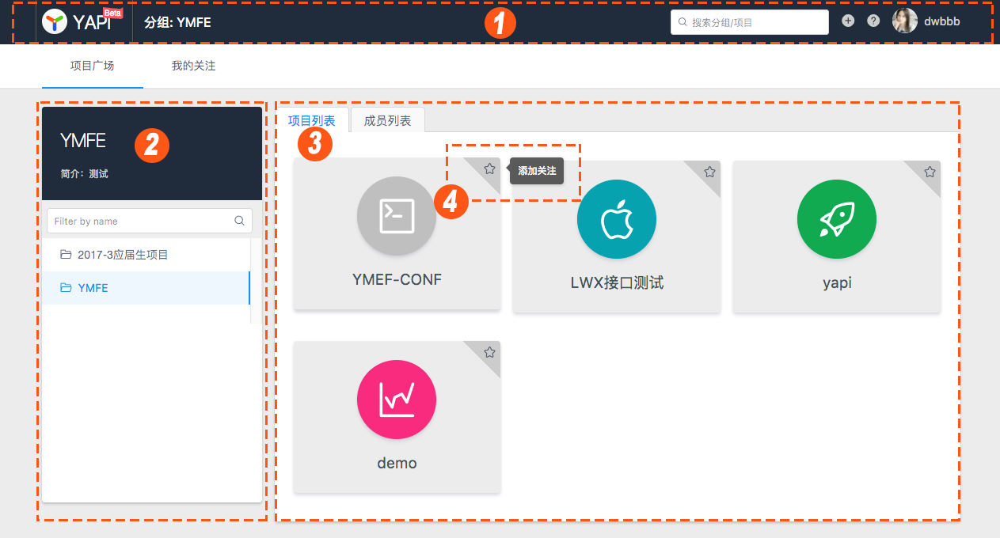
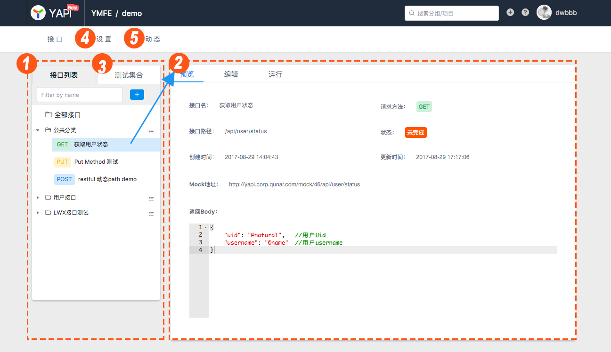
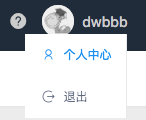
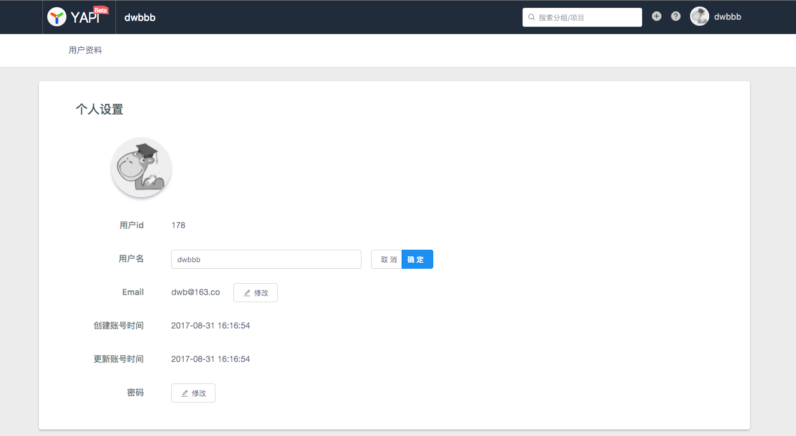
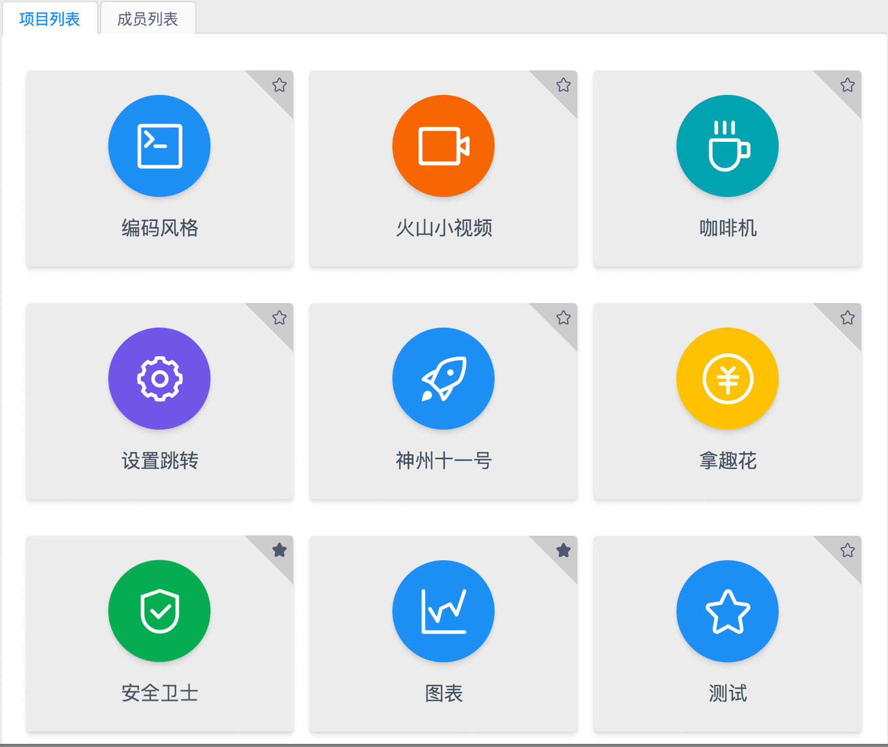
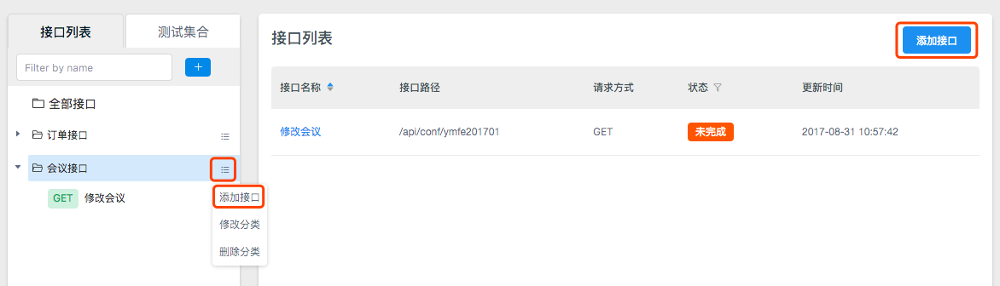
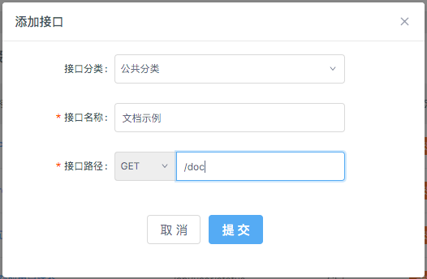
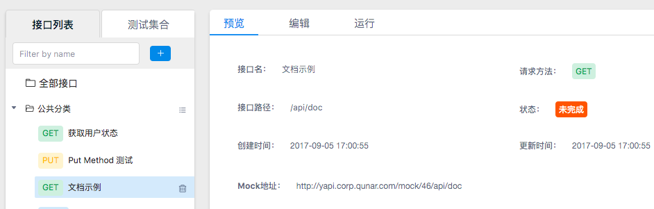

# 快速上手

> 创建时间：2020-08-01                
> 更新时间：{docsify-updated}

## 认识Yapi

在开始使用 YApi 之前，我们先来熟悉一下 YApi 的网站结构，这将让你快速了解YApi。

### 登录与注册

想要使用 YApi ，首先要注册账号。

  

### 首页

登录后进入首页，首页展示了分组与项目。

此时你作为新用户，没有任何分组与项目的权限，因此只能搜索、浏览 “公开项目” 的接口，如果在首页找不到任何项目，请联系管理员将你加入对应项目。

1. 首页头部展示了当前所在的位置、搜索框、新建项目、查看文档和用户信息。
2. 首页左侧展示分组信息，“分组”是“项目”的集合，只有超级管理员可以管理分组。
3. 首页右侧是分组下的项目和成员列表，点击左侧的某个分组，右侧会出现该分组下的项目和成员信息。
4. 点击项目右上角的星星即可关注项目，关注的项目可以在“我的关注”页面查看。

  

### 项目页

点击一个项目，进入项目页，项目页展示了属于该项目的全部接口，并提供项目、接口的全部操作。

此时你作为新用户，只能浏览接口信息，不可以编辑项目或接口，如果需要编辑，请联系管理员将你加入该项目。

1. 项目页左侧的 “接口列表” 展示了该项目下的所有接口，右侧默认显示该项目下所有接口的列表
2. 点击左侧的某个接口，右侧会出现“预览”、“编辑”和“运行”。
3. 点击左侧的 “测试集合” 使用测试集功能。
4. 点击二级导航的“设置”，项目组长即可编辑项目信息和管理成员列表。
5. 点击二级导航的“动态”，即可查看项目的操作日志。

  

### 个人中心

鼠标移动到右上角的用户头像或用户名上，即可点击“个人中心”查看个人信息。

  

在个人信息页面可以查看并修改自己的用户名、密码等信息。

  

## 创建第一个API

### 如何创建接口？

把大象装进冰箱分几步？三步：把冰箱门打开，把大象装进去，关门，搞定~

新建接口分几步？也是三步：

* 获取权限
* 找到一个项目
* 新建接口

### 获取权限

新用户登录拥有 个人空间 分组下的全部权限，个人空间分组仅自己可见，因此可以在这里任意试用 YApi 的功能。

除此以外没有任何项目或分组的权限，只能浏览已存在分组下面的公开项目。

如果找不到想找的项目，可能是尚未成为项目成员，此时应联系 项目组长 将你加入该项目。

### 选择项目

* 如果你已经登录，会在首页右侧看到一些项目 (可以在左侧的分组列表切换分组来查看不同分组下的项目)。
* 点击一个项目，进入该项目的详情页。

  

### 新建接口

* 点击左侧接口分组右侧的菜单按钮，选择 添加接口，或者点击接口列表右上角的 添加接口。

  

* 选择接口分类，输入接口名称和接口路径，点击 提交。

  

* 恭喜你！创建了第一个YApi的接口，你可以看到在左侧看到接口名称，右侧有该接口的信息预览。

  
